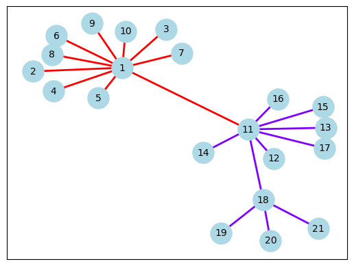
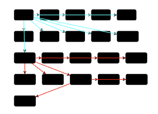

# Graph-Visualization

This project is designed to graphically represent graphs of any size.
It takes as input a graph stored in txt format where each line is composed of 3 integers: id of the starting node, id of the ending node and id of the edge between the two nodes (or id of the community to which that edge belongs). An example is in smallGraph/input/graph.txt.

The code is realised for two types of graph:
(1) The smallGraph folder contains code for displaying small graphs (order of tens of nodes) using the networkX library or the GoJS software.

(2) The bigGraph folder contains code for visualising large graphs (order of hundreds/thousands of nodes) using the networkX library and the ForcedGraph software.

